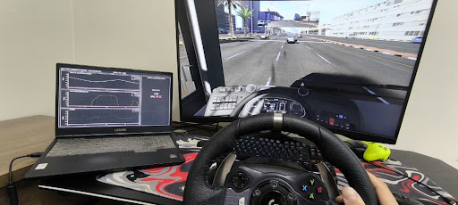

# KSA Bus Safety Monitor 🚍🇸🇦

**A real-time driver monitoring prototype designed for long-distance bus travel and Hajj transport in Saudi Arabia.**

*Figure 1: The custom "Command Center" dashboard showing real-time driver analysis.*

---

## ❓ The Problem
Traveling by bus between cities in Saudi Arabia (e.g., Riyadh to Jeddah) or during Hajj season involves long hours on the road.
While current GPS systems track **"Where"** the bus is, they often fail to track **"How"** it is being driven.

Aggressive behaviors like **sudden braking**, **sharp cornering**, or **jerky acceleration** can be dangerous for standing pilgrims or elderly passengers, even if no accident occurs.

## 💡 The Solution
I developed a "Virtual Observer" algorithm that runs in real-time. It connects to the bus telemetry system to monitor **Ride Quality** and **Passenger Comfort** from Point A to Point B.

Instead of just recording speed, it calculates a live **"Safety Score" (0-100%)** based on the physics of the bus.

## ⚙️ Key Features (The Logic)
The system monitors 4 critical safety parameters:

1.  **🛑 Comfort Monitoring (G-Force):** Detects harsh braking or turning (> 0.8G) that could cause passengers to fall.
2.  **🚀 Speed Control:** Penalizes drivers for exceeding the safety limit (set at 80 km/h for this prototype).
3.  **⚠️ Panic Braking (ABS Detection):** If the **ABS** activates, it means the driver braked too late or too hard. The score drops significantly.
4.  **📉 Aggressive Acceleration (TCS Detection):** If **Traction Control** activates, it indicates wheel spin (jerky start), which is uncomfortable for passengers.

## 📊 How It Works
The algorithm (written in JavaScript for SimHub) processes the data and outputs a status:

* 🟢 **READY / EXCELLENT (90-100%):** Smooth driving, safe for passengers.
* 🟡 **TRAINING (60-89%):** Minor mistakes, driver needs to be smoother.
* 🔴 **FAIL (< 60%):** Dangerous behavior, immediate intervention required.

---

## 📸 Project Setup & Testing
To validate the idea, I built a "Hardware-in-the-Loop" simulation using a **Logitech G920 Steering Wheel** connected to **Assetto Corsa** (Physics Engine) and **SimHub** (Telemetry Processing).

*Figure 2: The testing station showing the simulation loop (Wheel -> Game -> Telemetry Script -> Dashboard).*

---

## 🛠️ Tools Used
* **JavaScript:** The core logic script.
* **SimHub:** For telemetry data extraction and dashboard rendering.
* **Assetto Corsa:** To simulate realistic bus physics and road conditions.

## 🚀 Future Improvements
* Connect the system to a real accelerometer (Arduino/Raspberry Pi) for field testing.
* Develop a mobile app for Fleet Managers to view live scores.
* Integrate with **Vision 2030** Smart Transport initiatives.

---
*Developed by Muath - Computer Engineering Student*
